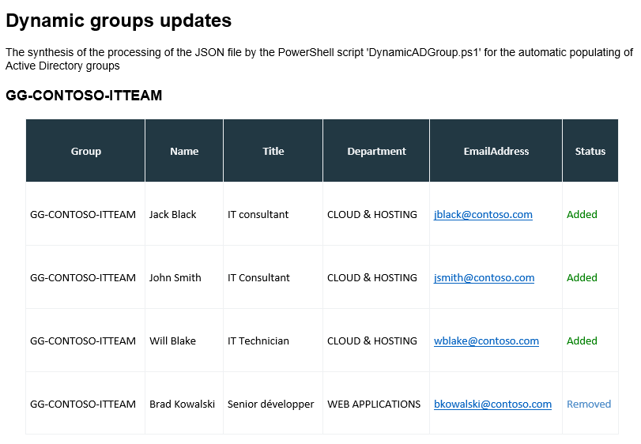

# Groupes Active Directory dynamiques

## Possibilités

Vous pouvez alimenter automatiquement des groupes Active Directory en fonction de règles d'appartenances qui se basent sur les valeurs des attributs Active Directory des comptes utilisateurs.

Dans 90% des cas, les règles d'appartenances vont se limiter aux attributs suivants :

- Department : le service dans lequel l'utilisateur travaille
- Title : le nom du poste qu'occupe l'utilisateur
- Office : l'emplacement du bureau de l'utilisateur

Cependant, il est possible de requêter sur tous les attributs Active Directory des comptes utilisateurs (extensionAttribute, accountExpirationDate...)

### Limitations

Quelques limitations sont a connaitre :

1. Ne convient pas aux groupes contenant plus de 5000 membres directs (limitation liée à PowerShell)
2. Ne met à jour que les membres directs des groupes
3. Ne doit pas être utilisé pour peupler automatiquement des groupes à privilèges (pour des raisons de sécurité)

### Compatibilité

Ce script est compatible avec les groupes existants, qu'importe leur type (domaine local, sécurité globale, sécurité de distribution, universel...). 

## Fonctionnement

### Résumé

Le script utilise des fichiers JSON pour peupler automatiquement les groupes demandés. Vous pouvez regrouper plusieurs groupes dynamiques dans un seul fichier JSON.

Propriété   | Description             | Type                  | Exemple
----------- | ----------------------- | --------------------- | -------
**Group**   | Nom du groupe à peupler | Chaine de caractères  | GG-CONTOSO-ITTEAM
Preset      | Réglage pré-défini      | Chaine de caractères  | EnabledOnly<br>Messaging
**Filter**  | Règle d'appartenance    | Bloc de script        | `$_.Title -in 'IT Technician','IT Manager'`
SearchBase  | Périmètre de recherche  | Chaine de caractères  | CONTOSO
Exceptions  | Exceptions              | Chaine multi-valeurs  | jack.black<br>john.smith
ReportTo    | Contacts à informer     | Chaine multi-valeurs  | <jblack@contoso.com><br><jsmith@contoso.com>

Les propriétés obligatoires sont indiquées en gras.

### Réglages pré-définis

Nom | Description
--- | -----------
Messaging | Ne garde que les comptes Active Directory actif avec une boite aux lettres active (RemoteMailbox)
EnabledOnly | Ne garde que les comptes Active Directory actif (Enabled = True)
DisabledOnly | Ne garde que les comptes Active Directory désactivés (Enabled = False)

Si vous ne spécifiez pas de réglage, aucun filtre ne sera fait avant la règle d'appartenance au groupe.

### Règle d'appartenance

Le filtre sera interprété dans une commande "Where-Object" et peut donc contenir :

- tous les opérateurs de comparaison (-LT, -GT, -EQ, -CONTAINS, -LIKE, -IN, -MATCH...)
- plusieurs conditions jointes via les opérateurs "AND" et "OR"
- gestion des priorités dans les comparaisons avec des parenthèses

Les attributs doivent être utilisés avec la syntaxe PowerShell plutôt que LDAP.

Lien vers la documentation : [Where-Object | Microsoft Learn](https://learn.microsoft.com/fr-fr/powershell/module/microsoft.powershell.core/where-object)

### Périmètre de recherche

Le périmètre de recherche permet de limiter la règle d'appartenance à une seule unité d'organisation (les unités d'organisation enfants font partie du périmètre).

Deux formes de périmètre de recherche sont acceptés :

- avec le nom de l'unité d'organisation directement sous le périmètre par défaut : CONTOSO
- le DistinguishedName complet vers l'unité d'organisation : OU=CONTOSO,DC=corp,DC=contoso,DC=com

Si aucun périmètre de recherche n'est spécifié, c'est le périmètre par défaut qui sera utilisé.

### Exceptions

Les exceptions permettent de conserver des membres dans un groupe, même s'ils ne correspondent pas aux règles d'appartenance de celui-ci. Les exceptions doivent être indiquées avec le SamAccountName de chaque compte, dans un objet JSON avec plusieurs valeurs.

### Contacts à informer

Des adresses emails peuvent être indiquées pour chaque groupe afin d'informer des mouvements (entrées et sorties) des membres du groupe. 

<div style='background-color: #efd77d; padding-left: 25px; padding-right: 25px; padding-top: 10px; padding-bottom: 10px; margin: 5px;'>
  <p><b>⚠️ Attention :</b> cette propriété JSON ne doit pas être confondue avec le paramètre général du script PowerShell qui permet d'avoir une revue complète de tous les mouvements sur tous les groupes du fichier JSON</p>
</div>

### Traduction en JSON

```json
[
    {
        "Group":  "GG-CONTOSO-ITTEAM",
        "Preset":  "EnabledOnly",
        "Filter":  "$_.Title -in 'IT Technician','IT Consultant'",
        "SearchBase":  "CONTOSO",
        "Exceptions":  [
            "jack.black",
            "john.smith"
        ]
    },
    {
        "Group":  "GG-FABRIKAM-SALESMGMT",
        "Filter":  "$_.Department -eq 'Sales' -and $_.Title -like 'Manager*'",
        "SearchBase":  "FABRIKAM",
        "ReportTo":  "jsmith@contoso.com"
    }
]
```

## Mise en tâche planifiée

### Paramètres du script

Paramètre | Valeur par défaut | Description
--------- | ----------------- | -----------
**JsonFile** | | Chemin vers le fichier JSON à traiter
**ReportTo** | | Destinataire(s) pour reçevoir le rapport complet sur les actions effectuées par le script
DefaultSearchBase | Racine du domaine | Périmètre de recherche des utilisateurs
TestRecipient | | Destinataire pour toutes les communications en cas de test (les actions d'ajout et suppression seront quand-même effectuées)
SmtpServer | smtp.contoso.com | Serveur de messagerie à utiliser
FromAddress | <noreply@contoso.com> | Adresse d'expédition
LogHistory | 15 | Nombre de jours maximum pour la conservation des fichiers de journalisation

Les paramètres obligatoires sont indiqués en gras.

Le script est également compatible avec les paramètres génériques comme `-Verbose` et `-WhatIf`.

### Mise en tâche planifiée

Vous pouvez créer une ou plusieurs tâche(s) planifiée pour mettre à jour les groupes. Vous pouvez utiliser un compte de service type GMSA (Group Managed Service Accounts) avec suffisamment de permissions dans l'Active Directory pour :

- lire les informations des comptes utilisateurs
- ajouter et supprimer les membres d'un groupe
- envoyer les emails de rapports

Il est recommandé d'utiliser un fichier JSON différent pour chaque tâche planifiée.

### Exemple d'utilisation

Voici un exemple de paramètres pour lancer le script PowerShell :

```powershell
.\DynamicADGroups.ps1 -JsonFile ".\data\TESTING.json" `
    -ReportTo "jsmith@contoso.com" `
    -DefaultSearchBase "OU=CONTOSO,DC=corp,DC=contoso,DC=com" `
    -SmtpServer "smtp.contoso.com" `
    -FromAddress "noreply@contoso.com" `
    -TestRecipient "jsmith@contoso.com" `
    -WhatIf -Verbose
```

### Message de synthèse

Après une exécution, le ou les destinataire(s) indiqué(s) dans le paramètre `-ReportTo` du script reçoivent une synthèse de toutes les modifications apportées aux groupes :


